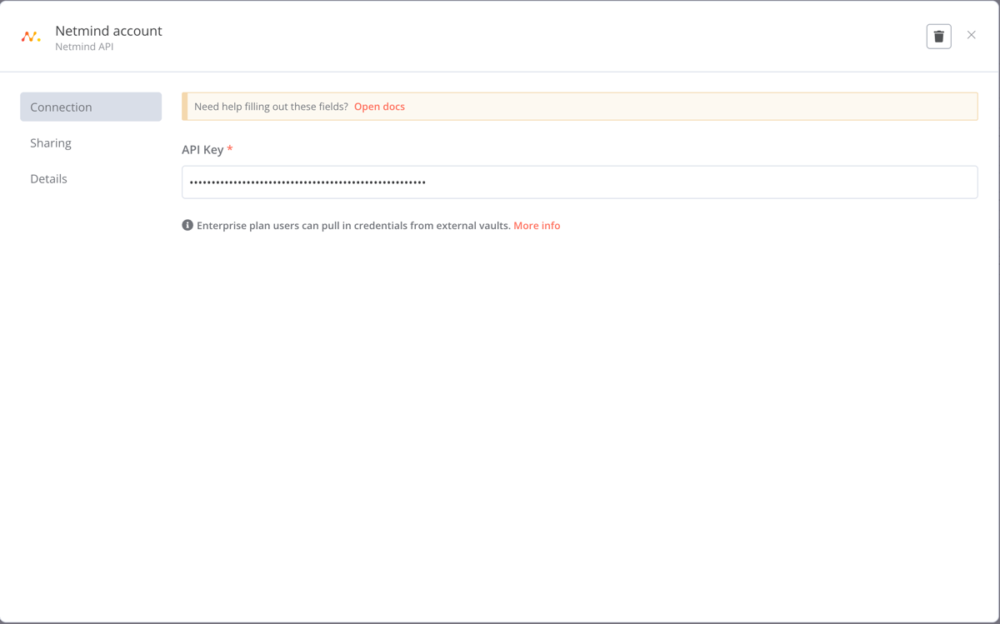
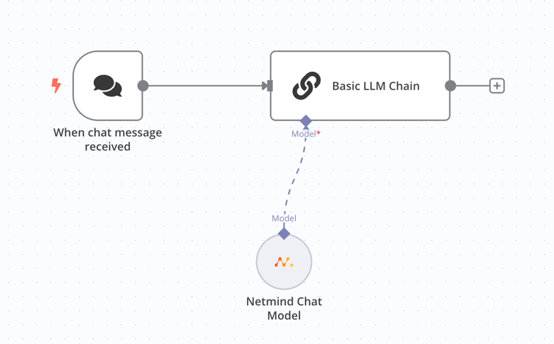
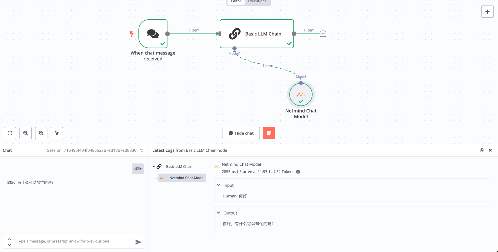
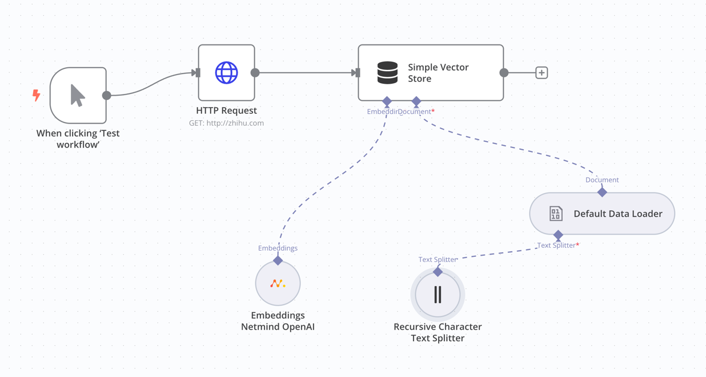
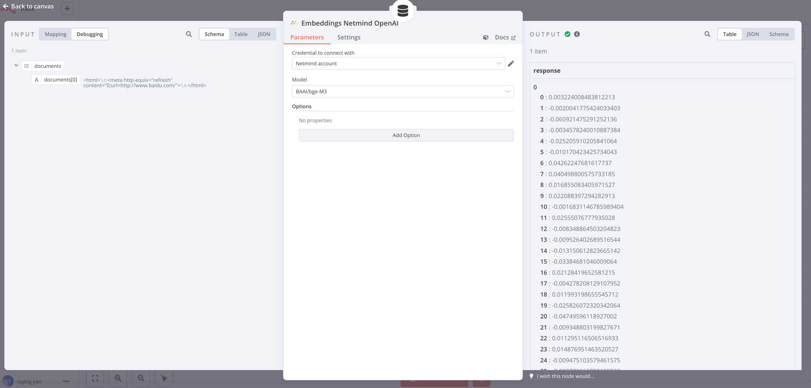

# n8n-nodes-netmind

This is an n8n community node. It lets you use Netmind AI in your n8n workflows.

Netmind Website: [Net the Future, Power the AI.](https://netmind.ai)

[n8n](https://n8n.io/) is a [fair-code licensed](https://docs.n8n.io/reference/license/) workflow automation platform.

[Installation](#installation)
[Credentials](#credentials)
[Compatibility](#compatibility)  
[Usage](#usage)
[Resources](#resources)

## Installation
Follow the [installation guide](https://docs.n8n.io/integrations/community-nodes/installation/) in the n8n community nodes documentation.

## Credentials
Add your Api Key and store securely

## Usage

### Chat Model

Add a Netmind Chat Model node to your workflow, select the action you want to perform, and enter the required fields.

Open Chat, input the text you want to generate. and the result will be displayed。

simple demo [here](examples/chat.json)

### Embedding Model
Add a Netmind Embedding Model node to your workflow, select the action you want to perform, and enter the required fields.

Run the workflow, and the result will be displayed in the Run Result node.

simple demo [here](examples/embdding.json)

## Resources

* [n8n community nodes documentation](https://docs.n8n.io/integrations/community-nodes/)
* [Netmind Website](https://netmind.ai)
* [github repo](https://github.com/protagolabs/n8n-nodes-netmind)

